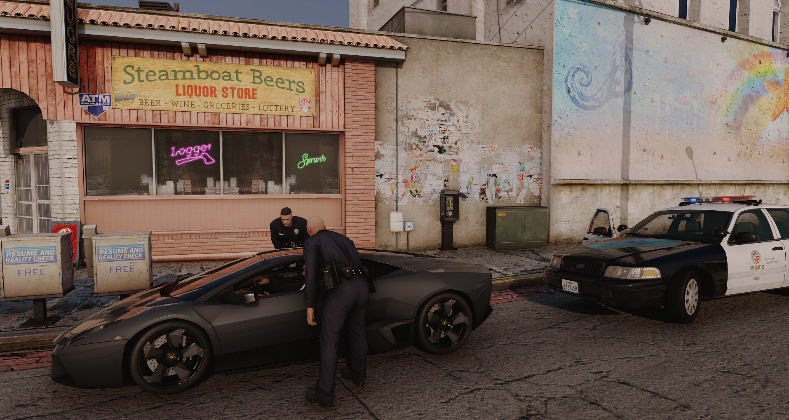

# Legal Faction

Essas organizações operam de forma integrada, cada uma com suas atribuições específicas, promovendo um roleplay mais estruturado e realista. Os personagens que ingressam nessas facções assumem funções oficiais, seguindo hierarquias, protocolos e responsabilidades próprias de seus cargos, contribuindo diretamente para a manutenção da ordem pública, do atendimento à população e do desenvolvimento institucional do servidor.

#### Acesse nosso discord do Legal Faction

<figure><figcaption></figcaption></figure>
