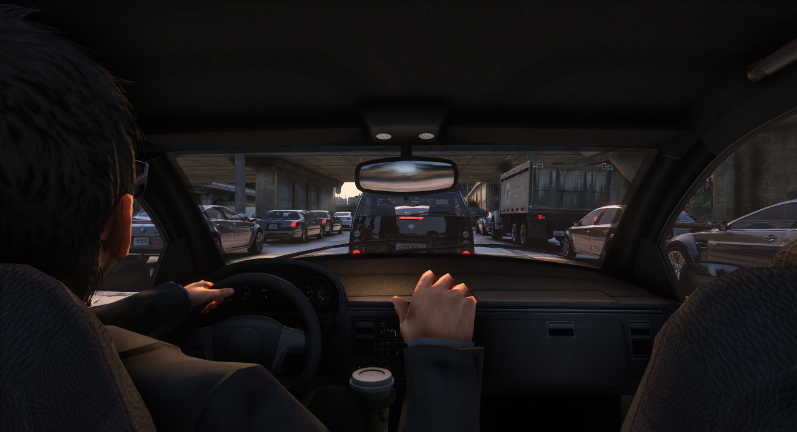

# Regras

As regras são a base que sustenta todo o funcionamento do servidor. Elas existem para garantir ordem, coerência e justiça em um ambiente onde várias pessoas compartilham a mesma narrativa. Sem regras claras e bem definidas, o roleplay perde sentido, vira caos e deixa de ser uma experiência imersiva para se tornar apenas um jogo desorganizado.

<figure><figcaption></figcaption></figure>
